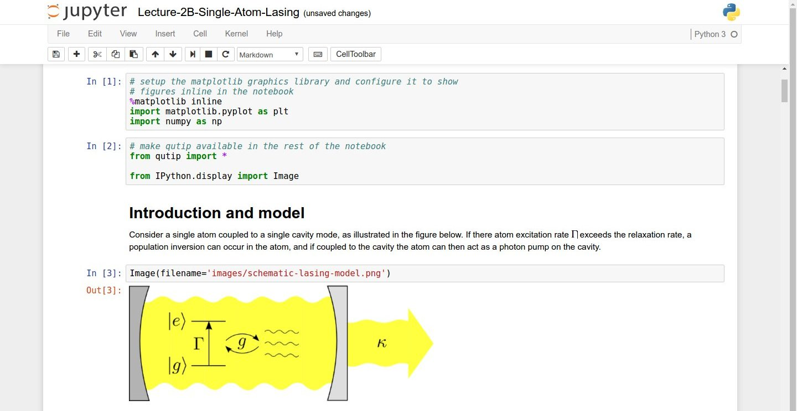

## Python programs are plain text files.

*   They have the `.py` extension to let everyone (including the operating system) 
    know it is a Python program.
    *   This is convention, not a requirement.
*   It's common to write them using a text editor but we are going to use
    the [Jupyter Notebook][jupyter].
*   The bit of extra setup is well worth it because the Notebook provides code completion 
    and other helpful features.
*   Notebook files have the extension `.ipynb` to distinguish them from plain-text Python programs.
    *   Can export as "pure Python" to run from the command line.

## Use the Jupyter Notebook for editing and running Python.

*   The [Anaconda package manager][anaconda] is an automated way to install the Jupyter notebook.
    *   See [the setup instructions]({{ page.root }}/setup/) for Anaconda installation instructions.
*   It also installs all the extra libraries it needs to run.
*   Once you have installed Python and the Jupyter Notebook requirements, open a shell and type:

    ~~~
    $ jupyter notebook
    ~~~
    {: .python}

*   This will start a Jupyter Notebook server and open your default web browser. 
*   The server runs locally on your machine only and does not use an internet connection.
*   The server sends messages to your browser.
*   The server does the work and the web browser renders the notebook.
*   You can type code into the browser and see the result when the web page talks to the server.
*   This has several advantages:
    *   You can easily type, edit, and copy and paste blocks of code.
    *   Tab complete allows you to easily access the names of things you are using
        and learn more about them.
    *   It allows you to annotate your code with links, different sized text, bullets, etc.
        to make it more accessible to you and your collaborators.
    *   It allows you to display figures next to the code that produces them
        to tell a complete story of the analysis.

  
*Screenshot of a [Jupyter Notebook on quantum mechanics](https://github.com/jrjohansson/qutip-lectures) by Robert Johansson*

> ## How It's Stored
>
> *   The notebook file is stored in a format called JSON.
> *   Just like a webpage, what's saved looks different from what you see in your browser.
> *   But this format allows Jupyter to mix software (in several languages) with documentation 
      and graphics, all in one file.
{: .callout}

## The Notebook has Command and Edit modes.

*   Open a new notebook from the dropdown menu (that says 'New') in the top right corner of the file browser page.
*   Each notebook contains one or more cells that contain code, text, or images.

> ## Code vs. Text
>
> We often use the term "code" to mean
> "the source code of software written in a language such as Python". 
> A "code cell" in a Notebook is a cell that contains software;
> a "text cell" is one that contains ordinary prose written for human beings.
{: .callout}

*   If you press "esc" and "return" alternately,
    the outer border of your code cell will change from gray/blue to green.
    *   The difference in color is subtle.
*   These are the command (gray) and edit (green) modes of your notebook.
*   In command mode, pressing the "H" key will provide 
    a list of all the shortcut keys.
*   Command mode alows you to edit notebook-level features, and edit mode changes the content of cells.
*   When in command mode (esc/gray),
    *   The "B" key will make a new cell below the currently selected cell.
    *   The "A" key will make one above.
    *   The "X" key will delete the current cell.
    *   The "Z" key will undo your last cell deletion.
*   All actions can be done using the menus,
    but there are lots of keyboard shortcuts to speed things up.
*   If you remember the "esc" and "H" shortcut, you will be able to find out all the rest.

> ## Command Vs. Edit
>
> In the Jupyter notebook page are you currently in command or edit mode?  
> Switch between the modes. 
> Use the shortcuts to generate a new cell. 
> Use the shortcuts to delete a cell
>
> > ## Solution
> >
> > Command mode has a grey boarder and Edit mode has a green border. 
> > Use "esc" and "Enter" to switch between modes. 
> > You need to be in command mode (Hit "esc" if your cell is green).  Type "B" or "A".
> > You need to be in command mode (Hit "esc" if your cell is green).  Type "X".
> >
> {: .solution}
{: .challenge}

## Use the keyboard and mouse to select and edit cells.

*   Pressing the "return" key turns the border green and engages edit mode,
    which allows you to type within the cell.
*   Because we want to be able to write many lines of code in a single cell,
    pressing the "return" key when in edit mode (green) moves the cursor to the next line in the cell just like in a text editor.
*   We need some other way to tell the Notebook we want to run what's in the cell.
*   Pressing the "shift" and the "enter" key together will execute the contents of the cell.
*   Notice that the "return" and "shift" keys on the 
    right of the keyboard are right next to each other.

## The Notebook will turn Markdown into pretty-printed documentation.

*   Notebooks can also render [Markdown][markdown].
    *   A simple plain-text format for writing lists, links, 
        and other things that might go into a web page.
    *   Equivalently, a subset of HTML that looks like what you'd send in an old-fashioned email.
*   Turn the current cell into a Markdown cell by entering 
    the command mode (esc/gray) and press the "M" key.
*   `In [ ]:` will disappear to show it is no longer a code cell
    and you will be able to write in Markdown.
*   Turn the current cell into a Code cell
    by entering the command mode (esc/gray) and press the "Y" key.

## Markdown does most of what HTML does.

  

~~~
*   Use asterisks
*   to create
*   bullet lists.
~~~
{: .python}
  

  

*   Use asterisks
*   to create
*   bullet lists.
  

  

~~~
1.  Use numbers
1.  to create
1.  numbered lists.
~~~
{: .python}
  

  

1.  Use numbers
1.  to create
1.  numbered lists.
  

  

~~~
*  You can use indents
	*  To create sublists 
	*  of the same type
*  Or sublists
	1. Of different
	1. types
~~~
{: .python}
  

  

*  You can use indents
	*  To create sublists of the same type
*  Or sublists
	1. Of different
	1. types
  

  

~~~
# A Level-1 Heading
~~~
{: .python}
  

  

# A Level-1 Heading
  

  

~~~
## A Level-2 Heading (etc.)
~~~
{: .python}
  

  

## A Level-2 Heading (etc.)
  

  

~~~
Line breaks
don't matter.

But blank lines
create new paragraphs.
~~~
{: .python}
  

  

Line breaks
don't matter.

But blank lines
create new paragraphs.
  

  

~~~
[Create links](http://software-carpentry.org) with `[...](...)`.
Or use [named links][data_carpentry].

[data_carpentry]: http://datacarpentry.org
~~~
{: .python}
  

  

[Create links](http://software-carpentry.org) with `[...](...)`.
Or use [named links][data_carpentry].

[data_carpentry]: http://datacarpentry.org
  

> ## Creating Lists in Markdown
>
> Create a nested list in a Markdown cell in a notebook that looks like this:
>
> 1.  Get funding.
> 2.  Do work.
>     *   Design experiment.
>     *   Collect data.
>     *   Analyze.
> 3.  Write up.
> 4.  Publish.
> 
> > ## Solution
> >
> > This challenge integrates both the numbered list and bullet list. 
> > Note that the bullet list is indented 2 spaces so that it is inline with the items of the numbered list.
> > ~~~
> > 1.  Get funding.
> > 2.  Do work.
> >     *   Design experiment.
> >     *   Collect data.
> >     *   Analyze.
> > 3.  Write up.
> > 4.  Publish.
> > ~~~
> > {: .python}
> {: .solution}
{: .challenge}

> ## More Math
>
> What is displayed when a Python cell in a notebook
> that contains several calculations is executed?
> For example, what happens when this cell is executed?
>
> ~~~
> 7 * 3
> 2 + 1
> ~~~
> {: .python}
> 
> > ## Solution
> >
> > Python returns the output of the last calculation.
> > ~~~
> > 3
> > ~~~
> > {: .python}
> {: .solution}
{: .challenge}

> ## Change an Existing Cell from Code to Markdown
>
> What happens if you write some Python in a code cell
> and then you switch it to a Markdown cell?
> For example,
> put the following in a code cell:
>
> ~~~
> x = 6 * 7 + 12
> print(x)
> ~~~
> {: .python}
>
> And then run it with shift+return to be sure that it works as a code cell.
> Now go back to the cell and use escape+M to switch the cell to Markdown
> and "run" it with shift+return.
> What happened and how might this be useful?
> 
> > ## Solution
> >
> > The Python code gets treated like markdown text.
> > The lines appear as if they are part of one contiguous paragraph.
> > This could be useful to temporarly turn on and off cells in notebooks that get used for multiple purposes. 
> > ~~~
> > x = 6 * 7 + 12 print(x)
> > ~~~
> > {: .python}
> {: .solution}
{: .challenge}

> ## Equations
>
> Standard Markdown (such as we're using for these notes) won't render equations,
> but the Notebook will.
> Create a new Markdown cell
> and enter the following:
>
> ~~~
> $\sum_{i=1}^{N} 2^{-i} \approx 1$
> ~~~
> {: .python}
>
> (It's probably easier to copy and paste.)
> What does it display?
> What do you think the underscore, `_`, circumflex, `^`, and dollar sign, `$`, do?
> 
> > ## Solution
> >
> > The notebook shows the equation as it would be rendered from latex equation syntax.
> > The dollar sign, `$`, is used to tell markdown that the text in between is a latex equation.
> > If you're not familiar with latex,  underscore, `_`, is used for subscripts and circumflex, `^`, is used for superscripts.
> > A pair of curly braces, `{` and `}`, is used to group text together so that the statement `i=1` becomes the the subscript and `N` becomes the superscript.
> > Similarly, `-i` is in curly braces to make the whole statement the superscript for `2`.
> > `\sum` and `\approx` are latex commands for "sum over" and "approximate" symbols. 
> {: .solution}
{: .challenge}

[anaconda]: https://docs.continuum.io/anaconda/install
[jupyter]: http://jupyter.org/
[markdown]: https://en.wikipedia.org/wiki/Markdown
