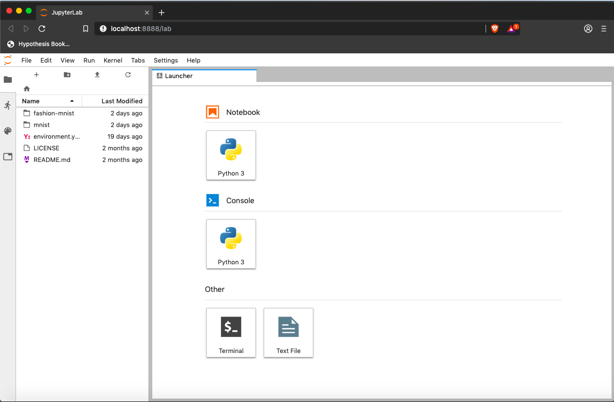
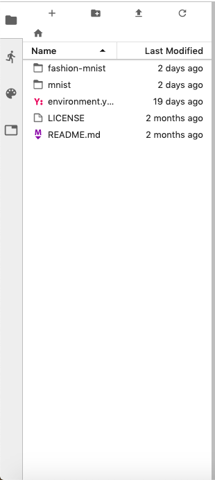

## Getting Started with JupyterLab

While many software developers will often use an integrated development environment (IDE) or a 
text editor to create and edit their Python programs we will be using [JupyterLab][jupyterlab] 
during this lesson. 

JupyterLab is an application with a web-based user interface from [Project Jupyter][jupyter] that 
enables one to work with documents and activities such as Jupyter notebooks, text editors, terminals,
and even custom components in a flexible, integrated, and extensible manner. JupyterLab requires a
reasonably up-to-date browser (ideally a current version of Chrome, Safari, or Firefox); Internet
Explorer versions 9 and below are *not* supported.

JupyterLab is included as part of the the Anaconda Python distribution. If you have not already 
installed the Anaconda Python distribution, see [the setup instructions]({{ page.root }}/setup/) 
for installation instructions.

Even though JupyterLab is a web-based application, JupyterLab runs locally on your machine and 
does not require an internet connection.
*   The JupyterLab server sends messages to your web browser.
*   The JupyterLab server does the work and the web browser renders the result.
*   You will type code into the browser and see the result when the web page talks to the 
    JupyterLab server.

> ## JupyterLab? What about Jupyter notebooks?
> 
> JupyterLab is the [next stage in the evolution of the Jupyter Notebook](https://jupyterlab.readthedocs.io/en/stable/getting_started/overview.html#overview). If you have prior 
> experience working with Jupyter notebooks, then you will have a a good idea of what to expect 
> from JupyterLab. 
> 
> Experienced users of Jupyter notebooks interested in a more detailed discussion of the similarities and differences
> between the JupyterLab and Jupyter notebook user interfaces can find more information in the 
> [JupyterLab user interface documentation][jupyterlab-ui].
>
{: .callout}

## Starting JupyterLab

### Mac OS X
To start the JupyterLab server you will need to access the command line through the Terminal. 
There are two ways to open Terminal on Mac.

1. In your Applications folder, open Utilities and double-click on Terminal
2. Press <kbd>Command</kbd> + <kbd>spacebar</kbd> to launch Spotlight. Type `Terminal` and then 
double-click the search result or hit <kbd>Enter</kbd>

After you have launched Terminal, type the command to launch the JupyterLab server.

~~~
$ jupyter lab
~~~
{: .bash}

### Windows Users
To start the JupyterLab server you will need to access the open Anaconda Prompt.

Press <kbd>Windows Logo Key</kbd> and search for `Anaconda Prompt`, click the result or press enter.

After you have launched the Anaconda Prompt, type the command:

~~~
$ jupyter lab
~~~
{: .bash}

Below is a screenshot of a similar JupyterLab landing page to the one that should open in your 
default web browser after starting the JupyterLab server on wither Mac OS X or Windows.

  

## The JupyterLab Interface

JupyterLab has many features found in traditional integrated development environments (IDEs) but 
is focused on providing flexible building blocks for interactive, exploratory computing.

The [JupyterLab Interface](https://jupyterlab.readthedocs.io/en/stable/user/interface.html) 
consists of the Menu Bar, a collapsable Left Side Bar, and the Main Work Area which contains tabs 
of documents and activities.

### Menu Bar

The Menu Bar at the top of JupyterLab has the top-level menus that expose various actions 
available in JupyterLab along with their keyboard shortcuts (where applicable). The following 
menus are included by default.

*   **File:** Actions related to files and directories such as *New*, *Open*, *Close*, *Save*, etc. The *File* menu also includes the *Quit* action used to shutdown the JupyterLab server.
*   **Edit:** Actions related to editing documents and other activities such as *Undo*, *Cut*, *Copy*, *Paste*, etc.
*   **View:** Actions that alter the appearance of JupyterLab.
*   **Run:** Actions for running code in different activities such as notebooks and code consoles (discussed below).
*   **Kernel:** Actions for managing kernels which, as mentioned above, are separate processes for running code.
*   **Tabs:** A list of the open documents and activities in the dock panel.
*   **Settings:** Common JupyterLab settings can be configured using this menu. There is also an *Advanced Settings Editor* option in the dropdown menu that provides more fine-grained control of JupyterLab settings and configuration options.
*   **Help:** A list of JupyterLab and kernel help links.

A screenshot of the default Menu Bar is provided below.

    

### Left Sidebar

The left sidebar contains a number of commonly-used tabs, such as a file browser (showing the 
contents of the directory in which the JupyterLab server was launched!), a list of running kernels 
and terminals, the command palette, and a list of open tabs in the main work area. A screenshot of 
the default Left Side Bar is provided below.

    

The left sidebar can be collapsed or expanded by selecting “Show Left Sidebar” in the View menu or 
by clicking on the active sidebar tab.

### Main Work Area

The main work area in JupyterLab enables you to arrange documents (notebooks, text files, etc.) 
and other activities (terminals, code consoles, etc.) into panels of tabs that can be resized or 
subdivided. A screenshot of the default Menu Bar is provided below.

    

Drag a tab to the center of a tab panel to move the tab to the panel. Subdivide a tab panel by 
dragging a tab to the left, right, top, or bottom of the panel. The work area has a single current 
activity. The tab for the current activity is marked with a colored top border (blue by default).

## Creating a Python script

*   To start writing a new Python program click the Text File icon under the *Other* header in the Launcher tab of the Main Work Area.
    *   You can also create a new plain text file by selecting the *New -> Text File* from the *File* menu in the Menu Bar.
*   To convert this plain text file to a Python program, select the *Save File As* action from the *File* menu in the Menu Bar and give your new text file a name that ends with the `.py` extension.
    *   The `.py` extension lets everyone (including the operating system) know that this text file is a Python program.
    *   This is convention, not a requirement.

## Creating a Jupyter Notebook

To open a new notebook click the Python 3 icon under the *Notebook* header in the Launcher tab in 
the main work area. You can also create a new notebook by selecting *New -> Notebook* from the *File* menu in the Menu Bar.

Additional notes on Jupyter notebooks.

  *   Notebook files have the extension `.ipynb` to distinguish them from plain-text Python programs.
  *   Notebooks can be exported as Python scripts that can be run from the command line.

Below is a screenshot of a Jupyter notebook running inside JupyterLab. If you are interested in 
more details, then see the [official notebook documentation][jupyterlab-notebook-docs].

    

> ## How It's Stored
>
> *   The notebook file is stored in a format called JSON.
> *   Just like a webpage, what's saved looks different from what you see in your browser.
> *   But this format allows Jupyter to mix source code, text, and images, all in one file.
{: .callout}

> ## Arranging Documents into Panels of Tabs
>
> In the JupyterLab Main Work Area you can arrange documents into panels of tabs. Here is an 
> example from the [official documentation][jupyterlab].
> 
> 

>    
> 

>
> First, create a text file, Python console, and terminal window and arrange then into three 
> panels in the main work area. Next, create a notebook, terminal window, and text file and 
> arrange then into three panels in the main work area. Finally, create your own combination of 
> panels and tabs. What combination of panels and tabs do you think will be most useful for your 
> workflow?
>
> > ## Solution
> >
> > After creating the necessary tabs, you can drag one of the tabs to the center of a panel to 
> > move the tab to the panel; next you can subdivide a tab panel by dragging a tab to the left, 
> > right, top, or bottom of the panel.
> >
> {: .solution}
{: .challenge}

## Use the Jupyter Notebook for editing and running Python.

*   While it's common to write Python scripts using a text editor, we are going to use the [Jupyter Notebook][jupyter] for the remainder of this workshop.
*   This has several advantages:
    *   You can easily type, edit, and copy and paste blocks of code.
    *   Tab complete allows you to easily access the names of things you are using
        and learn more about them.
    *   It allows you to annotate your code with links, different sized text, bullets, etc.
        to make it more accessible to you and your collaborators.
    *   It allows you to display figures next to the code that produces them
        to tell a complete story of the analysis.
*   Each notebook contains one or more cells that contain code, text, or images.

> ## Code vs. Text
>
> Jupyter mixes code and text in different types of blocks, called cells. We often use the term
> "code" to mean "the source code of software written in a language such as Python".
> A "code cell" in a Notebook is a cell that contains software;
> a "text cell" is one that contains ordinary prose written for human beings.
{: .callout}

## The Notebook has Command and Edit modes.

*   If you press <kbd>Esc</kbd> and <kbd>Return</kbd> alternately, the outer border of your code cell will change from gray to blue.
*   These are the **Command** (gray) and **Edit** (blue) modes of your notebook.
*   Command mode allows you to edit notebook-level features, and Edit mode changes the content of cells.
*   When in Command mode (esc/gray),
    *   The <kbd>b</kbd> key will make a new cell below the currently selected cell.
    *   The <kbd>a</kbd> key will make one above.
    *   The <kbd>x</kbd> key will delete the current cell.
    *   The <kbd>z</kbd> key will undo your last cell operation (which could be a deletion, creation, etc).
*   All actions can be done using the menus, but there are lots of keyboard shortcuts to speed things up.

> ## Command Vs. Edit
>
> In the Jupyter notebook page are you currently in Command or Edit mode?  
> Switch between the modes. 
> Use the shortcuts to generate a new cell. 
> Use the shortcuts to delete a cell.
> Use the shortcuts to undo the last cell operation you performed.
>
> > ## Solution
> >
> > Command mode has a grey border and Edit mode has a blue border. 
> > Use <kbd>Esc</kbd> and <kbd>Return</kbd> to switch between modes. 
> > You need to be in Command mode (Press <kbd>Esc</kbd> if your cell is blue).  Type <kbd>b</kbd> or <kbd>a</kbd>.
> > You need to be in Command mode (Press <kbd>Esc</kbd> if your cell is blue).  Type <kbd>x</kbd>.
> > You need to be in Command mode (Press <kbd>Esc</kbd> if your cell is blue).  Type <kbd>z</kbd>.
> >
> {: .solution}
{: .challenge}

### Use the keyboard and mouse to select and edit cells.

*   Pressing the <kbd>Return</kbd> key turns the border blue and engages Edit mode, which allows 
    you to type within the cell.
*   Because we want to be able to write many lines of code in a single cell,
    pressing the <kbd>Return</kbd> key when in Edit mode (blue) moves the cursor to the next line 
    in the cell just like in a text editor.
*   We need some other way to tell the Notebook we want to run what's in the cell.
*   Pressing <kbd>Shift</kbd>+<kbd>Return</kbd> together will execute the contents of the cell.
*   Notice that the <kbd>Return</kbd> and <kbd>Shift</kbd> keys on the right of the keyboard are 
    right next to each other.

### The Notebook will turn Markdown into pretty-printed documentation.

*   Notebooks can also render [Markdown][markdown].
    *   A simple plain-text format for writing lists, links, 
        and other things that might go into a web page.
    *   Equivalently, a subset of HTML that looks like what you'd send in an old-fashioned email.
*   Turn the current cell into a Markdown cell by entering the Command mode (<kbd>Esc</kbd>/gray) 
    and press the <kbd>M</kbd> key.
*   `In [ ]:` will disappear to show it is no longer a code cell and you will be able to write in 
    Markdown.
*   Turn the current cell into a Code cell by entering the Command mode (<kbd>Esc</kbd>/gray) and 
    press the <kbd>y</kbd> key.

### Markdown does most of what HTML does.

  

~~~
*   Use asterisks
*   to create
*   bullet lists.
~~~
  

  

*   Use asterisks
*   to create
*   bullet lists.
  

  

~~~
1.  Use numbers
1.  to create
1.  numbered lists.
~~~
  

  

1.  Use numbers
1.  to create
1.  numbered lists.
  

  

~~~
*  You can use indents
	*  To create sublists 
	*  of the same type
*  Or sublists
	1. Of different
	1. types
~~~
  

  

*  You can use indents
	*  To create sublists
	*  of the same type
*  Or sublists
	1. Of different
	1. types
  

  

~~~
# A Level-1 Heading
~~~
  

  

# A Level-1 Heading
  

  

~~~
## A Level-2 Heading (etc.)
~~~
  

  

## A Level-2 Heading (etc.)
  

  

~~~
Line breaks
don't matter.

But blank lines
create new paragraphs.
~~~
  

  

Line breaks
don't matter.

But blank lines
create new paragraphs.
  

  

~~~
[Create links](http://software-carpentry.org) with `[...](...)`.
Or use [named links][data_carpentry].

[data_carpentry]: http://datacarpentry.org
~~~
  

  

[Create links](http://software-carpentry.org) with `[...](...)`.
Or use [named links][data_carpentry].

[data_carpentry]: http://datacarpentry.org
  

> ## Creating Lists in Markdown
>
> Create a nested list in a Markdown cell in a notebook that looks like this:
>
> 1.  Get funding.
> 2.  Do work.
>     *   Design experiment.
>     *   Collect data.
>     *   Analyze.
> 3.  Write up.
> 4.  Publish.
> 
> > ## Solution
> >
> > This challenge integrates both the numbered list and bullet list. 
> > Note that the bullet list is indented 2 spaces so that it is inline with the items of the numbered list.
> > ~~~
> > 1.  Get funding.
> > 2.  Do work.
> >     *   Design experiment.
> >     *   Collect data.
> >     *   Analyze.
> > 3.  Write up.
> > 4.  Publish.
> > ~~~
> {: .solution}
{: .challenge}

> ## More Math
>
> What is displayed when a Python cell in a notebook
> that contains several calculations is executed?
> For example, what happens when this cell is executed?
>
> ~~~
> 7 * 3
> 2 + 1
> ~~~
> {: .language-python}
> 
> > ## Solution
> >
> > Python returns the output of the last calculation.
> > ~~~
> > 3
> > ~~~
> > {: .language-python}
> {: .solution}
{: .challenge}

> ## Change an Existing Cell from Code to Markdown
>
> What happens if you write some Python in a code cell
> and then you switch it to a Markdown cell?
> For example,
> put the following in a code cell:
>
> ~~~
> x = 6 * 7 + 12
> print(x)
> ~~~
> {: .language-python}
>
> And then run it with <kbd>Shift</kbd>+<kbd>Return</kbd> to be sure that it works as a code cell.
> Now go back to the cell and use <kbd>Esc</kbd> then <kbd>m</kbd> to switch the cell to Markdown
> and "run" it with <kbd>Shift</kbd>+<kbd>Return</kbd>.
> What happened and how might this be useful?
> 
> > ## Solution
> >
> > The Python code gets treated like Markdown text.
> > The lines appear as if they are part of one contiguous paragraph.
> > This could be useful to temporarily turn on and off cells in notebooks that get used for multiple purposes. 
> > ~~~
> > x = 6 * 7 + 12 print(x)
> > ~~~
> > {: .language-python}
> {: .solution}
{: .challenge}

> ## Equations
>
> Standard Markdown (such as we're using for these notes) won't render equations,
> but the Notebook will.
> Create a new Markdown cell
> and enter the following:
>
> ~~~
> $\sum_{i=1}^{N} 2^{-i} \approx 1$
> ~~~
>
> (It's probably easier to copy and paste.)
> What does it display?
> What do you think the underscore, `_`, circumflex, `^`, and dollar sign, `$`, do?
> 
> > ## Solution
> >
> > The notebook shows the equation as it would be rendered from LaTeX equation syntax.
> > The dollar sign, `$`, is used to tell Markdown that the text in between is a LaTeX equation.
> > If you're not familiar with LaTeX,  underscore, `_`, is used for subscripts and circumflex, `^`, is used for superscripts.
> > A pair of curly braces, `{` and `}`, is used to group text together so that the statement `i=1` becomes the the subscript and `N` becomes the superscript.
> > Similarly, `-i` is in curly braces to make the whole statement the superscript for `2`.
> > `\sum` and `\approx` are LaTeX commands for "sum over" and "approximate" symbols. 
> {: .solution}
{: .challenge}

## Closing JupyterLab

*   From the Menu Bar select the "File" menu and the choose "Quit" at the bottom of the dropdown menu. You will be prompted to confirm that you wish to shutdown the JupyterLab server (don't forget to save your work!). Click "Confirm" to shutdown the JupyterLab server.
*   To restart the JupyterLab server you will need to re-run the following command from a shell.

~~~
$ jupyter lab
~~~

> ## Closing JupyerLab
>
> Practice closing and restarting the JupyterLab server.
> 
{: .challenge}
[anaconda]: https://docs.continuum.io/anaconda/install
[jupyterlab-ui]: https://jupyterlab.readthedocs.io/en/stable/user/interface.html
[jupyterlab-notebook-docs]: https://jupyterlab.readthedocs.io/en/stable/user/notebook.html
[markdown]: https://en.wikipedia.org/wiki/Markdown


