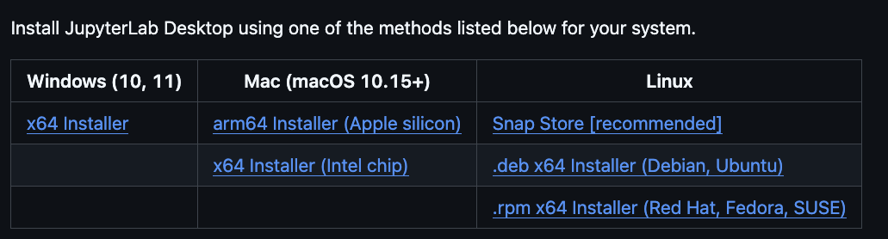
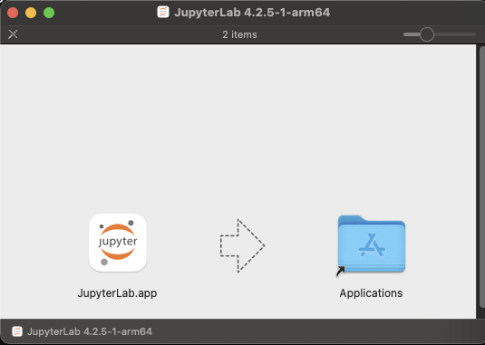
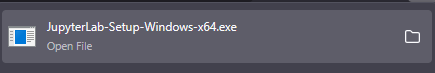
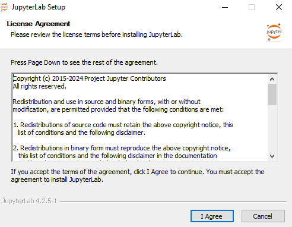
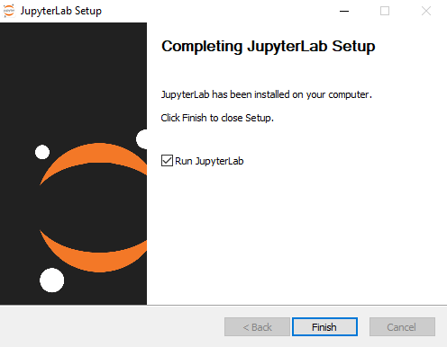
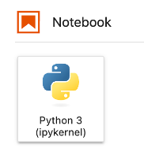
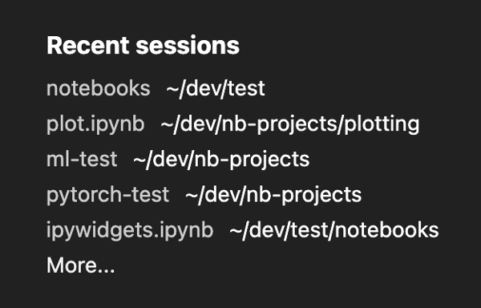
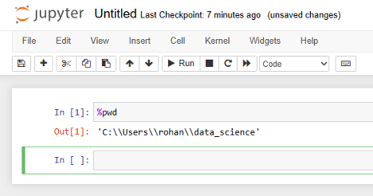
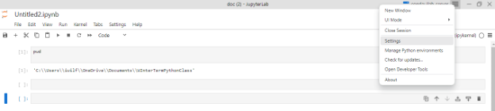
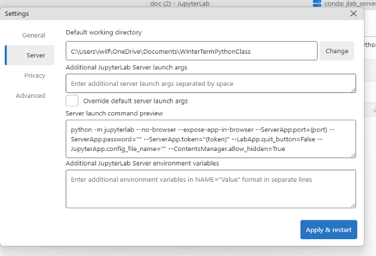

::::::::::::::::::::::::::::::::::::::: objectives

- Download JupyterLab Desktop.
- Install JuptyterLab Desktop.
- Learn about folders and files on your computer.
- Create a folder for the Jupyter notebooks you will create during this workshop series.
- Learn what a working directory is and set the working directory for your project.
- Set the default working directory for JupyterLab Desktop.

::::::::::::::::::::::::::::::::::::::::::::::::::

:::::::::::::::::::::::::::::::::::::::: questions

- How do I install JupyterLab Desktop?
- How do I configure JupyterLab Desktop so I can find my files again?

::::::::::::::::::::::::::::::::::::::::::::::::::

## Getting Started with JupyterLab Desktop

[JupyterLab Desktop](https://github.com/jupyterlab/jupyterlab-desktop) is a desktop application with an integrated web user interface from [Project Jupyter][jupyter] that
enables one to work with documents and activities such as Jupyter notebooks, text editors, terminals,
and even custom components in a flexible, integrated, and extensible manner. Jupyter notebooks are common in data science and visualization and serve as a convenient common-denominator experience for running Python code interactively where we can easily view and share the results of our Python code.

There are other ways of editing, managing, and running code, but Jupyter notebooks 
let us execute and view the results of our Python code immediately within the notebook.

## Why Run Jupyter Notebooks in JupyterLab Desktop
We use JupyterLab Desktop because it's convenient for our learners:

- It does not require knowledge of the command line to install.
- It is available on MacOS, Windows, and Linux devices.
- It does not require users to install Python separately.

## Installing JupyterLab Desktop
How you install JupyterLab Desktop will depend on your operating system.

- If you have a Mac laptop, [click here](#installing-jupyterlab-desktop-macos).
- If you a Windows laptop, [click here](#installing-jupyterlab-desktop-windows).

## Installing JupyterLab Desktop: MacOS

Before installing JupyterLab Desktop on a Mac, you will need to know the type of processor
your computer has. 

Depending on when you bought your laptop, your mac may have an Apple Silicon chip
or an Intel Chip. For JupyterLab Desktop to work correctly, you must install the version of the
program that corresponds to the right chip.

### Finding Your Processor Chip Type

1. Click on the Apple icon in the top left corner of your screen.
2. Select *About this Mac*.
3. Look at the line labeled *Chip*.
  - If your chip name begins with Apple, it is an Apple Silicon processor.
  - If your chip name begins with Intel, it is an Intel processor.

   

### Downloading Jupyter Lab
Go to the [JupyterLab Installation](https://github.com/jupyterlab/jupyterlab-desktop?tab=readme-ov-file#installation) page.

   

From the **Mac (macOS 10.15+)** column, select the download that corresponds to your chip type.
Click to download the file to your computer. 

Once the download has completed, double-click the *.dmg* file.

   

Drag the JupyterLab.app application to the Applications folder on the right.
This will install the JupyterLab app to the Applications folder on your computer.

:::::::::::::::::::::::::::::::::::::::::  callout

## What Are .dmg Files?

- A *.dmg file is a disk image file, typically used to install software on MacOS. 
- If you do not drag the JupyterLab app icon to your Applications folder, it will run from the *.dmg* file instead.
- By copying the JupyterLab app icon to the Applications folder, you tell your computer that you want the contents
of the *.dmg* copied and installed to your Applications so that you can use the application later.
- You can delete (and eject) the *.dmg* file after you've installed JupyterLab. 
  
::::::::::::::::::::::::::::::::::::::::::::::::::

When the installation has finished, close the installer window.

## Installing JupyterLab Desktop: Windows

### Downloading JupyterLab Desktop for Windows
Go to the [JupyterLab Installation](https://github.com/jupyterlab/jupyterlab-desktop?tab=readme-ov-file#installation) page.

   

From the **Windows (10, 11)** column, select the *x64 Installer*.
Click to download the file to your computer.  

### Installing JupyterLab Desktop
Locate the downloaded file (it will often go to your Downloads folder by default) 
to start the installation process. Double-click it.

   

You will see a launcher like this open.

   

When the application has finished installing, click *Finish*
to complete the installation and open JupyterLab Desktop.

   

## The JupyterLab Interface

JupyterLab has many features found in traditional integrated development environments (IDEs) but
is focused on providing flexible building blocks for interactive, exploratory computing.

The [JupyterLab Interface][jupyterlab-ui]
consists of the Menu Bar, a collapsable Left Side Bar, and the Main Work Area which contains tabs
of documents and activities.

### Menu Bar

The Menu Bar at the top of JupyterLab has the top-level menus that expose various actions
available in JupyterLab along with their keyboard shortcuts (where applicable). 

A screenshot of the default Menu Bar is provided below.

   

### Main Work Area

The main work area in JupyterLab enables you to arrange documents (notebooks, text files, etc.)
and other activities (terminals, code consoles, etc.) into panels of tabs that can be resized or
subdivided. A screenshot of the default Main Work Area is provided below.

If you do not see the Launcher tab, click the blue plus sign under the "File" and "Edit" menus and it will appear.

   

### Left Sidebar

The left sidebar contains a number of commonly used tabs. Most importantly for us, it has a file browser (showing the
contents of the directory where the JupyterLab server was launched). The directory where the JupyterLab server was launched will function as your working directory. This matters because if you want to reference other data files in your code, JupyterLab will look for them here by default. A screenshot of
the default Left Side Bar is provided below.

   

The left sidebar can be collapsed or expanded by selecting "Show Left Sidebar" in the View menu or
by clicking on the active sidebar tab.

On Macs, the file browser displays automatically, but on Windows this file browser view is often hidden by default. We recommend that you turn it on using the following steps.

Step 1: Click on view in the menu bar. This opens a drop down menu of options. 	Select “File Browser”  

   

 
Step 2: When you click on File Browser, this will open up the file directory as shown above.  

:::::::::::::::::::::::::::::::::::::::::  callout

## What is a Working Directory?

- A working directory (or current working directory) is the current folder or location on a computer's file system where a program or process is operating by default. 
- The working directory is the default location where Python will look for files you want to load and where it will put any files you save.
- You will write your code in Jupyter Notebooks, and save them for later in a folder. Jupyter Notebooks are file type that ends in `.ipynb`.
- It's a good idea to save your code files in the same folder where you save any data files that you want to analyze. In this workshop your data files will be in the open source spreadsheet format `.csv`. 
  
::::::::::::::::::::::::::::::::::::::::::::::::::

## Create your JupyterLab Working Directory

* When you save files in Jupyter Lab, they will be saved automatically to your working directory (also known as a folder). You will also put data files you will use in this course in the same folder, to make it easier for you to tell the Python interpreter how to find the files.  
* **The best way to avoid confusion about your working directory is to set it properly when you start your session.** As [explained on the JupyterLab Desktop ReadMe](https://github.com/jupyterlab/jupyterlab-desktop?tab=readme-ov-file#sessions-and-projects) (https://github.com/jupyterlab/jupyterlab-desktop?tab=readme-ov-file\#sessions-and-projects), you can start a new session by opening JupyterLab Desktop (double clicking on the JupyterLab Desktop icon) and then using the links at the Start section of the Welcome Page.

   

1. Close and re-open JupyterLab Desktop  
2. Choose `Open...` (`Open Folder...` on Windows) and create a new directory (folder) that you will use to keep all of your workshop materials in. This directory (folder) should be specific to this workshop. Be sure to put it somewhere on your computer, such as your Documents folder or Desktop, where you will be able to find it again. If you have already created a folder for this workshop, you can select that instead of creating a new one.

## Create and save a Jupyter Notebook file to your Working Directory

Now that JupyterLab is reopened, click on Python 3 in the Launcher to create a new Jupyter Notebook: 

   

Use the menu or save icon to save this blank notebook. Make sure to name it something helpful\! For example, `PythonWorkshop` or `PythonDay1`. Notice that JupyterLab will append `.ipynb` to the end of the name of the notebook. This is the file extension for Jupyter Notebooks.

In the future, you can open to this working directory by any of the following:

* Double click in finder to open this file.  
* Open JupyterLab Desktop, and from the Start screen click on the relevant item in the Recent sessions list to restore this session.

   

## Verify your Working Directory

You can verify that you have the correct working directory by using what's called a *magic* command. Use the %pwd magic command within a code cell to print the current working directory. The output will display the current directory path.

   

  
This magic command passes the "print working directory" command to your computer. [Learn more about pwd here](https://superbasics.beholder.uk/command-line/example-pwd/) ([https://superbasics.beholder.uk/command-line/example-pwd/](https://superbasics.beholder.uk/command-line/example-pwd/)).

## How to Change your Default Working Directory in Python

While we have showed you how to create a folder and set it as the working directory for an individual session in JupyterLab, you may also wish to change your default working directory to somewhere where you will often store code files. To do this, you need to access your settings menu.

Step 1:  Find the 3 vertical bars in the top right of your screen next to the kernel and click on them (be aware: this is only available in JupyterLab Desktop, not Anaconda). This will bring up a drop-down menu with a list of options. 

   

Step 2: Once that drop down menu is open, click on settings.

   

Step 3: Clicking on settings will open up a screen similar to the one below. Click on the server as is highlighted below. Here we can change our working directory. Click on Change.

   

Step 5: Search your file directory for a folder you will recognize. For now, consider setting the folder you have just created for this workshop as your working directory. Above you can tell I named my default working directory “PythonWorkshop”. Now all my scripts of python code from JupyterLab will be saved in that folder when I choose to save them. 

:::::::::::::::::::::::::::::::::::::::: keypoints

- JupyterLab Desktop is an application for running files for managing and organizing Python
code called Jupyter notebooks.
- You will only need to install JupyterLab Desktop once for this workshop.
- Your current working directory determines where programs are run and how
filepaths are interpreted.

::::::::::::::::::::::::::::::::::::::::::::::::::