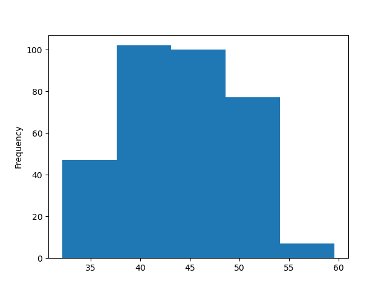
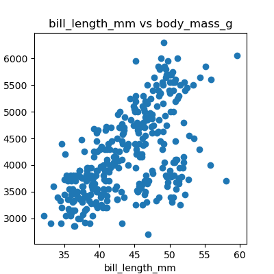
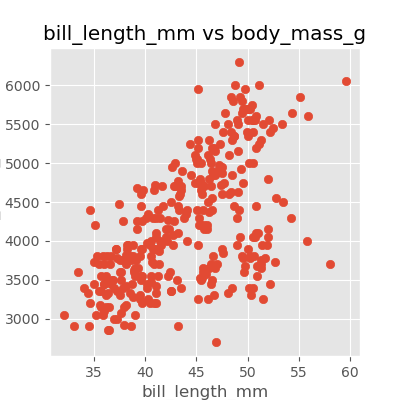
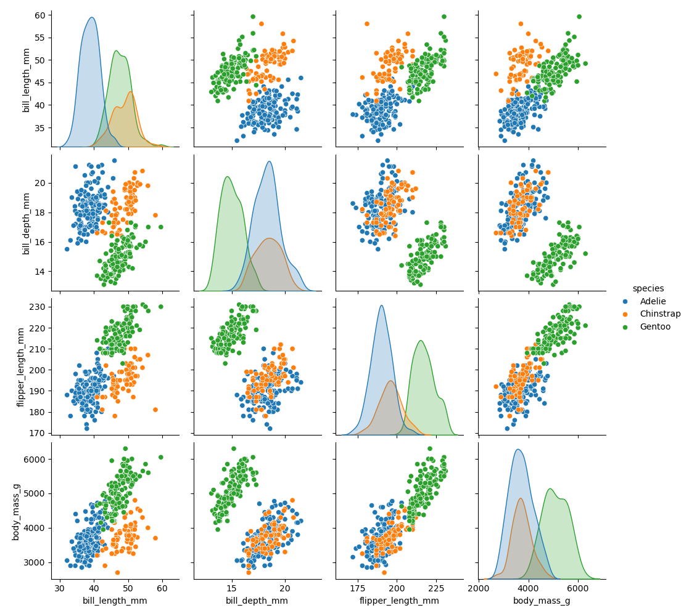
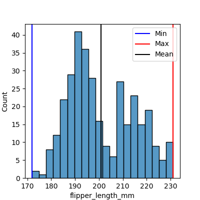
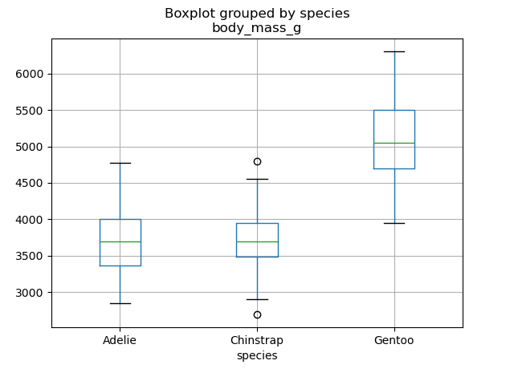
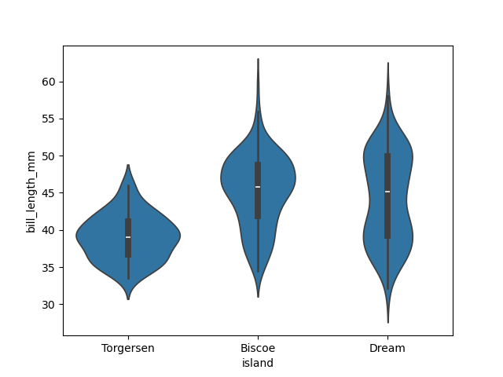
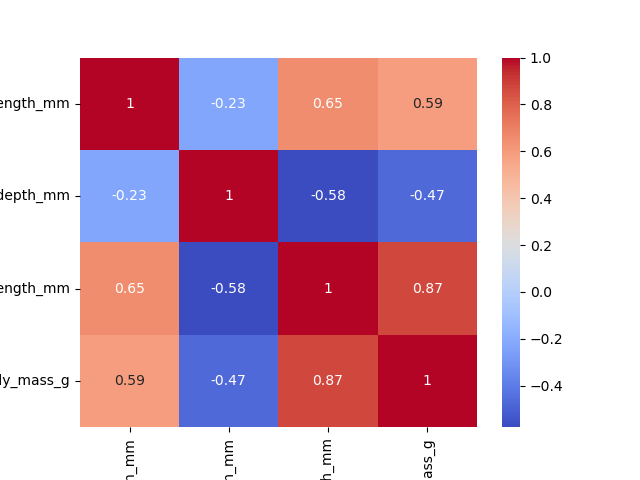

::::::::::::::::::::::::::::::::::::::: objectives

- Create a time series plot showing a single data set.
- Create a scatter plot showing relationship between two data sets.

::::::::::::::::::::::::::::::::::::::::::::::::::

:::::::::::::::::::::::::::::::::::::::: questions

- How can I plot my data?
- How can I save my plot for publishing?

::::::::::::::::::::::::::::::::::::::::::::::::::

## [`matplotlib`](https://matplotlib.org/) is the most widely used scientific plotting library in Python.

- Commonly use a sub-library called [`matplotlib.pyplot`](https://matplotlib.org/stable/tutorials/introductory/pyplot.html).
- The Jupyter Notebook will render plots inline by default.

```python
import matplotlib.pyplot as plt
```

- Simple plots are then (fairly) simple to create.

```python
time = [0, 1, 2, 3]
position = [0, 100, 200, 300]

plt.plot(time, position)
plt.xlabel('Time (hr)')
plt.ylabel('Position (km)')
```


:::::::::::::::::::::::::::::::::::::::::  callout

## Display All Open Figures

In our Jupyter Notebook example, running the cell should generate the figure directly below the code.
The figure is also included in the Notebook document for future viewing.
However, other Python environments like an interactive Python session started from a terminal
or a Python script executed via the command line require an additional command to display the figure.

Instruct `matplotlib` to show a figure:

```python
plt.show()
```

This command can also be used within a Notebook - for instance, to display multiple figures
if several are created by a single cell.

::::::::::::::::::::::::::::::::::::::::::::::::::

## Plot data directly from a [`Pandas dataframe`](https://pandas.pydata.org/pandas-docs/stable/reference/api/pandas.DataFrame.html).

You can easily create plots directly from a [Pandas dataframes](https://pandas.pydata.org/pandas-docs/stable/generated/pandas.DataFrame.html). For example, to create a histogram of the bill_length_mm column in the data_penguins DataFrame, you can use the following code:

```python
data_penguins['bill_length_mm'].plot(kind='hist', bins=5)
```



## Many styles of plot are available.

Let's plot scatter plot to see the correlation between bill length and body mass of penguins using `matplotlib`.

- First you need to select figure size using figure parameter in `.figure` method under `figsize` parameter.

```python
plt.figure(figsize=(4,4))
```

- Use scatter method to plot a scatterplot.

```python
plt.scatter(data_penguins['bill_length_mm'], data_penguins['body_mass_g'])
```

- Finally, add additinal information like title, and x and y axis names 

Full code:

```python
plt.figure(figsize=(4,4))
plt.scatter(data_penguins['bill_length_mm'], data_penguins['body_mass_g'])
plt.title('bill_length_mm vs body_mass_g')
plt.xlabel('bill_length_mm')
plt.ylabel('body_mass_g')
```



:::::::::::::::::::::::::::::::::::::::::  callout

## Using different styles for plots.

You can choose plots style with `matplotlib` [(more here)](https://matplotlib.org/stable/gallery/style_sheets/style_sheets_reference.html). We can re-create the previous scatter plot using the style from the widely used ggplot2 package for R by setting the style to 'ggplot':

```python
plt.style.use('ggplot')
```


::::::::::::::::::::::::::::::::::::::::::::::::::

## Data can also be plotted by using `seaborn`.

Plots in python are usually plotted using `matplotlib` and `seaborn`. Here is an example of plotting the same scatter plot using `seaborn` with points coloured by species. 

We can also add a slope line which describes the correlation between the points, providing additional information about the data.

```python
import seaborn as sns

plt.figure(figsize=(4,4))
sns.scatterplot(data=data_penguins, x='bill_length_mm', y='body_mass_g', hue='species')

slope, intercept = np.polyfit(data['bill_length_mm'], data_penguins['body_mass_g'], 1) # 1 because linear (polynomial)
x = np.linspace(data_penguins['bill_length_mm'].min(), data_penguins['bill_length_mm'].max(), 100)
y = slope * x + intercept
plt.plot(x, y, color='black', label=f'Linear fit: y = {slope:.2f}x + {intercept:.2f}')

plt.title('bill_length_mm vs body_mass_g')
plt.xlabel('bill_length_mm')
plt.ylabel('body_mass_g')
plt.legend()
```


The pairplot function in `seaborn` is a powerful tool for visualising relationships between multiple variables in a dataset and get a comprehensive overview of the dataset:

```python
import pandas as pd

data_penguins = pd.read_csv('data-palmers-penguins.csv')
sns.pairplot(data_penguins, hue="species")
```



## More examples of plots.

In both `matplotlib` and `seaborn`, you can plot many types of plots:

- Scatter Plots: useful for visualising relationships between two continuous variables.
- Histograms: great for showing the distribution of a single continuous variable.
- Bar Plots: effective for comparing categorical data.
- Line Plots: ideal for displaying trends over time or continuous data.

In the following example, we create a histogram to visualize the distribution of flipper lengths in the penguins dataset. This plot will help us understand how flipper lengths vary across the population.

```python
plt.figure(figsize=(4,4))
# code for matplotlib
# plt.hist(data['flipper_length_mm'], bins=20)
sns.histplot(data=data_penguins, x='flipper_length_mm', bins=20)
```


:::::::::::::::::::::::::::::::::::::::::  callout

## Enhancing plots with additional metrics.

It is important to make your diagram display useful statistics. For histograms, you can display minimum and maximum values as well as the mean value using `.axvline()` method.

```python
plt.figure(figsize=(4,4))
sns.histplot(data=data_penguins, x='flipper_length_mm', bins=20)

plt.axvline(data_penguins['flipper_length_mm'].min(), label='Min', color='blue')
plt.axvline(data_penguins['flipper_length_mm'].max(), label='Max', color='red')
plt.axvline(data_penguins['flipper_length_mm'].mean(), label='Mean', color='black')
plt.legend()
```



:::::::::::::::::::::::::

::::::::::::::::::::::::::::::::::::::::::::::::::

:::::::::::::::::::::::::::::::::::::::  challenge

## Exploring other useful types of plots with seaborn 

Use `seaborn` documentation to create the following plots:

- Boxplot - plot variation of body mass of the penguins by species
- Violin - plot variation of bil length of the penguins by their location (island)
- Heatmap - plot a heat map showing correlation between numerical features in the plot (hint: you first need to find out how to create a correlation matrix).


:::::::::::::::  solution

## Solution

```python
plt.figure(figsize=(8,6))
data.boxplot(column='body_mass_g', by='species')
```



```python
sns.violinplot(data=data_penguins, x='island', y='bill_length_mm')
```



```python
correlation_matrix = data_penguins.select_dtypes(include='number').corr()
sns.heatmap(correlation_matrix, annot=True, cmap='coolwarm')
```



:::::::::::::::::::::::::

::::::::::::::::::::::::::::::::::::::::::::::::::

:::::::::::::::::::::::::::::::::::::::::  callout

## Saving your plot to a file

If you are satisfied with the plot you see you may want to save it to a file,
perhaps to include it in a publication. There is a function in the
matplotlib.pyplot module that accomplishes this:
[savefig](https://matplotlib.org/stable/api/_as_gen/matplotlib.pyplot.savefig.html).
Calling this function, e.g. with

```python
plt.savefig('my_figure.png')
```

will save the current figure to the file `my_figure.png`. The file format
will automatically be deduced from the file name extension (other formats
are pdf, ps, eps and svg).

It is also important to note that you can specify the DPI (dots per inch) when saving a figure with plt. Here's a basic example:

```python
plt.savefig('my_figure.png', dpi=300)
```
In this example, dpi=300 will save the figure at 300 DPI, which is a good quality for printing. This is also important if you are creating a figure for journal articles, where there are specific DPI standards. 

Note that functions in `plt` refer to a global figure variable
and after a figure has been displayed to the screen (e.g. with `plt.show`)
matplotlib will make this  variable refer to a new empty figure.
Therefore, make sure you call `plt.savefig` before the plot is displayed to
the screen, otherwise you may find a file with an empty plot.

When using dataframes, data is often generated and plotted to screen in one line.
In addition to using `plt.savefig`, we can save a reference to the current figure
in a local variable (with `plt.gcf`) and call the `savefig` class method from
that variable to save the figure to file.

```python
data.plot(kind='bar')
fig = plt.gcf() # get current figure
fig.savefig('my_figure.png')
```

::::::::::::::::::::::::::::::::::::::::::::::::::

:::::::::::::::::::::::::::::::::::::::::  callout

## Making your plots accessible

Whenever you are generating plots to go into a paper or a presentation, there are a few things you can do to make sure that everyone can understand your plots.

- Always make sure your text is large enough to read. Use the `fontsize` parameter in `xlabel`, `ylabel`, `title`, and `legend`, and [`tick_params` with `labelsize`](https://matplotlib.org/stable/api/_as_gen/matplotlib.axes.Axes.tick_params.html) to increase the text size of the numbers on your axes.
- Similarly, you should make your graph elements easy to see. Use `s` to increase the size of your scatterplot markers and `linewidth` to increase the sizes of your plot lines.
- Using color (and nothing else) to distinguish between different plot elements will make your plots unreadable to anyone who is colorblind, or who happens to have a black-and-white office printer. For lines, the `linestyle` parameter lets you use different types of lines. For scatterplots, `marker` lets you change the shape of your points. If you're unsure about your colors, you can use [Coblis](https://www.color-blindness.com/coblis-color-blindness-simulator/) or [Color Oracle](https://colororacle.org/) to simulate what your plots would look like to those with colorblindness.
  

::::::::::::::::::::::::::::::::::::::::::::::::::

:::::::::::::::::::::::::::::::::::::::: keypoints

- [`matplotlib`](https://matplotlib.org/) is the most widely used scientific plotting library in Python.
- Plot data directly from a Pandas dataframe.
- Select and transform data, then plot it.
- Many styles of plot are available: see the [Python Graph Gallery](https://python-graph-gallery.com/matplotlib/) for more options.
- Can plot many sets of data together.

::::::::::::::::::::::::::::::::::::::::::::::::::


